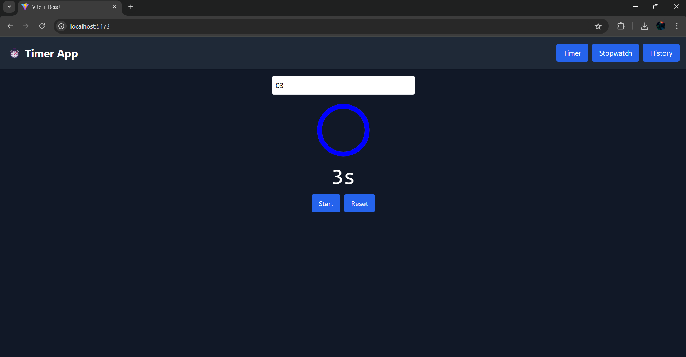

# ⏳ Timer & Stopwatch Web App

A modern, responsive  Timer & Stopwatch application built with **React**, **Tailwind CSS**, and **Vite**. It supports:
- ⏱ Countdown Timer with animation and audio alert
- 🛑 Millisecond-precision Stopwatch
- 📜 Activity History saved to Local Storage
- 🔔 Notification popups & alert sounds on completion

---

## 🔥 Features

- Elegant UI with responsive layout
- Animated circular countdown
- Timer and stopwatch with controls
- Realtime timer value from input field
- Web Notification + sound alert on timer completion
- Stores history of completed timers

---

## 📸 Screenshots

### 🕒 Timer


### ⏱ Stopwatch


### 📖 History 


---

## 🚀 Getting Started

### Prerequisites
- Node.js ≥ 14
- npm / yarn / pnpm

### Installation

```bash
git clone https://github.com/your-username/Timer-app.git
cd Timer-app
npm install
npm run dev

```
### 🛠 Customization
You can replace the default alarm.mp3 audio file by placing your preferred sound in the public/ folder and updating the reference inside Timer.jsx.

To change the circle color or animation speed, update the stroke and transition values in the SVG inside Timer.jsx.


 